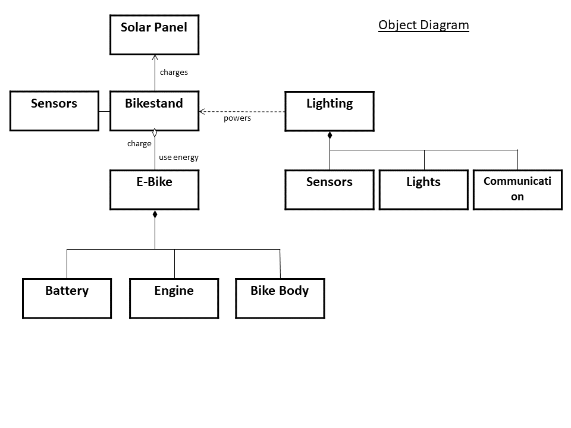

# Assignment1 - Practice Designing Models (Template)

> * Participant name: Markus Loennig
> * Project Title: Motion Activated, Solar powered Technical solution for Electrically Redundant (MASTER) City Lighting
## General Introduction

A very **smart city** is an urban area that uses different types of electronic data collection sensors to supply information which is used to manage assets and resources efficiently.

This proposed solution will regard 3 aspects in a Smart City. Clean electicity generation and storage (solar powered), clean and free personal mobility (E-Bikes) and improved, power saving street lighting (motion sensors). 
1. Electricity will be generated by solar panels and stored by the bike stands and the repective E-Bikes. They will be the power-source for the city street lighting during the night/dark. The stored electricity in the bikestands and the E-Bikes can also be used to locally buffer power shortages/outages in case of emergencies (Hurricane) in the respective vicinity.
2. The E-bikes will be available especially in the vicinity of business centers, knots of public transportation and centralized parking facilities to be used to go to work (without congesting the city centers) in the morning and go back to the respective transportation means in the evening/after work. They are free to use for a certain period of time (e.g. 60 min), in which they have to be put into a bikestand (loading station) again. Another E-Bike can be used immediatly. Longer usage of the same bike will result in (small-moderate) costs.
3. During dark hours, the E-Bike usage will be significantly less so the stored power will be available to power the city lighting. The lighting is motion sensitive and equipped with certain logic to only lighten streets where it is necessary due to pedestrian or car traffic. Other sensors and systems (e.g. automatic 911 in case of accident/violence..) can be integrated into the lighting system, but this is not the topic for this aspects solution.

Historical context: quite a few major cities in Europe offer such a Bike rental system (free for some period of time), some even with E-Bikes, but none use the E-Bikes as "electrical infrastructure" or to power other systems. Japan is researching the possibility to use E-Cars (especially the ones generating power like the "Prius") to integrate them into the electrical distribution system in case of emergency (earthquake) to buffer local shortages. 
The proposed "MASTER City Lighting" solution adapted this idea on a smaller scale.

## Requirements (Experimental Design)

The requirements for the MASTER City Lighting system are:

Solar panels will generate the needed energy to charge the Bikestands and the E-Bikes. 
The solar panels shall automatically move to the best angle (within +20° horizontally) to harvest the sun with regard to the seasons.
It shall be able to heat itself (with or without external power source) enough to melt and/or free itself of snow (in conjunction with the 20° angle rise). The solar panels should also serve as roof for the Bikestand.

The energy storage capacity of the combined Bikestands (at least 80%) and E-Bikes (at least75%) shall be sufficient to power the attached city street lighting.
Each Bikestand will hold at least 20 E-Bikes.
The electrical capacity of each Bikestand shall be sufficient to charge at least 50%  of the Stands respective capacity at daytime (in normal operation, average weather sunshine conditions --> normal operation and conditions TBD). 
The recharge time (from 15% to 90%) for an E-Bike is less than 45 minutes. 
The E-Bikes shall be capable to drive at least 15mph (electrically) but not be faster than 30mph.
The range of an E-Bikes (fully electric) shall be at least 15 miles (environmental conditions like weight of rider, slope... tbd). 

The lighting shall be sensitive enough to identify single pedestrians with a height of at least 3 feet in a distance of at least 50 feet (area of responsibility). 
The lighting will use bright, high luminosity, low power LEDs with a high angle of illumination.   
The lighting shall be able to identify when pedestrians are present (stopped movement) and will keep illuminating.
The lighting shall automatically engage when pedestrians or cars are within its area of responsibility.
The lighting will measure the speed of the cars to "inform" the next lights to engage in due time (warning function) and give longer/wider field of illumination when faster.

## MASTER City Lighting Model

The models underlying the MASTER City Lighting will be under the given Links.

* [**Object Diagram**](model/object_diagram.md) - provides the high level overview of components and explanation.
* [**Class Diagram**](model/class_diagram.md) - provides details of the involved classes, their variables and respective functions. 
* [**Behavior Diagram**](model/behavior_diagram.md) - provides details in form of a statechart of the electrical charge and the capability to power the Lighting system. 

## Smart City MASTER Lighting Simulation

The intended discrete-event based simulation will help evaluate the overall capacity in the different environments in which it is supposed to work in. This information will help to make decisions on the right size and layout of MASTER City Lighting.

[**Analysis Section**](analysis/README.md)

## Smart City MASTER City Lighting Model
I have coded 4 out of 11 different classes, including attributes/variables and very basic (empty) functions.
[**Code template**](code/README.md) 

## **P**ortable **O**rganic **T**rouble-free **S**elf-watering System (**POTS**) Model
Here [**are the Models**](code/POTS_system/README.md) of the **P**ortable **O**rganic **T**rouble-free **S**elf-watering System (**POTS**)
