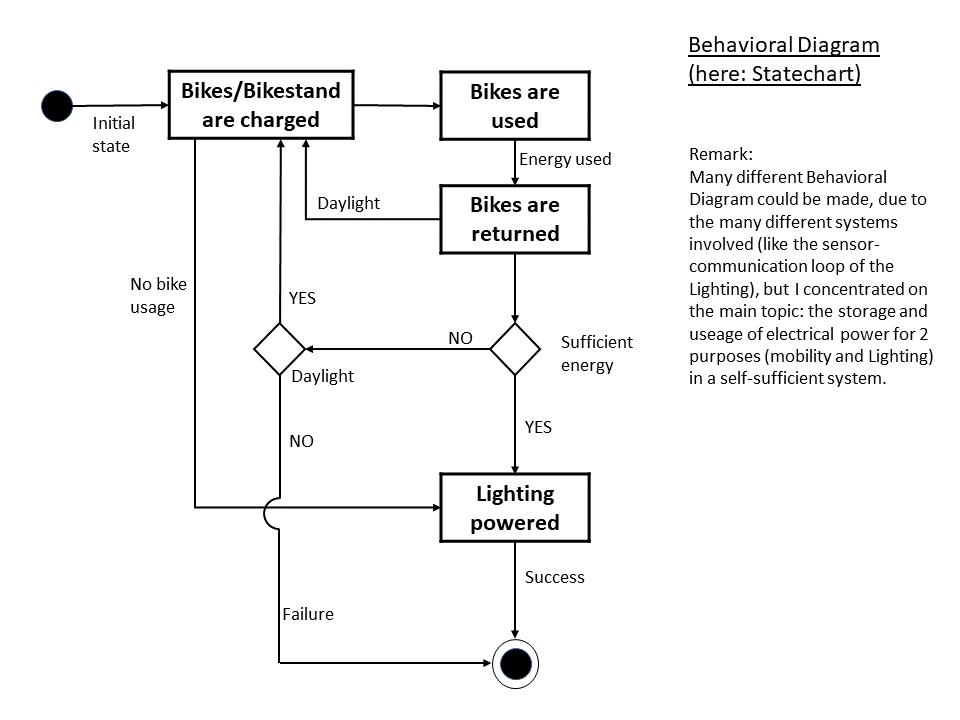

## Smart City (MASTER Street Lights) Model - Behavioral Diagram

This behavioral diagram 

Behavioral diagrams visualize, specify, construct, and document the dynamic aspects of a system. 
The behavioral diagrams are categorized as follows: use case diagrams, interaction diagrams, statechart diagrams, 
and activity diagrams.

depicts each involved class (top section) with (some/relevant) variables and attributes (middle section) and 
their respective functions and operations (lower sections). It shows that the class "E-Bike" is composed of the classes " "Baterry", 
"Engine" and "Bike Body". Since the system is assumed to be self sufficient, it also shows that the class "Lighting" is dependant on the 
Bikestand. A function of the Bikestand is to +power lights(), which is the prerequisite for the Lighting to work. 

